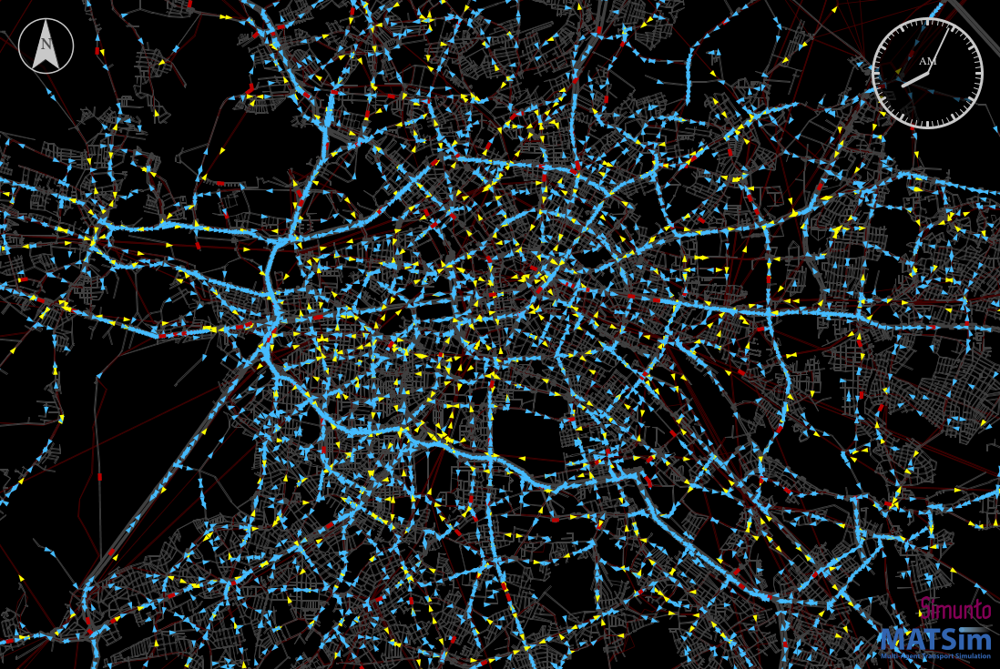

[](https://travis-ci.org/matsim-scenarios/matsim-berlin)

# The MATSim Open Berlin Scenario


## About this project

This repository provides an open MATSim transport model for Berlin, provided by the [Transport Systems Planning and Transport Telematics group](https://www.vsp.tu-berlin.de) of [Technische Universität Berlin](http://www.tu-berlin.de). Please reference/cite the scenario based on <a rel="license" href="https://doi.org/10.1016/j.procs.2019.04.120">this paper</a>.

<a rel="TU Berlin" href="https://www.vsp.tu-berlin.de"></a>

Currently, there are two versions of the MATSim Open Berlin model:

### 10pct scenario (`scenarios/berlin-v5.x-10pct`)

This scenario contains a 10pct sample of the Greater Berlin population; road capacities are accordingly reduced. The scenario is calibrated taking into consideration the traffic counts, modal split and mode-specific trip distance distributions.
    
### 1pct scenario (`scenarios/berlin-v5.x-1pct`)

This scenario contains a 1pct sample of the Greater Berlin population; road capacities are accordingly reduced. This scenario was not (!) calibrated and should only be used for testing purposes or pre-studies.

## Licenses

The **MATSim program code** in this repository is distributed under the terms of the [GNU General Public License as published by the Free Software Foundation (version 2)](https://www.gnu.org/licenses/old-licenses/gpl-2.0.en.html). The MATSim program code are files that reside in the `src` directory hierarchy and typically end with `*.java`.

The **MATSim input files, output files, analysis data and visualizations** are licensed under a <a rel="license" href="http://creativecommons.org/licenses/by/4.0/">Creative Commons Attribution 4.0 International License</a>
<a rel="license" href="http://creativecommons.org/licenses/by/4.0/"></a>.

<br /> MATSim input files are those that are used as input to run MATSim. They often, but not always, have a header pointing to matsim.org. They typically reside in the `scenarios` directory hierarchy. MATSim output files, analysis data, and visualizations are files generated by MATSim runs, or by postprocessing.  They typically reside in a directory hierarchy starting with `output`.

**Other data files**, in particular in `original-input-data`, have their own individual licenses that need to be individually clarified with the copyright holders.

## Note

Handling of large files within git is not without problems (git lfs files are not included in the zip download; we have to pay; ...).  In consequence, large files, both on the input and on the output side, reside at https://svn.vsp.tu-berlin.de/repos/public-svn/matsim/scenarios/countries/de/berlin . Please check out the latest release / the latest numbered branch since those are stable. The master branch is an potentially unstable development head. 

----
## Simple things (without installing/running MATSim)

### Movies

1. Go to https://svn.vsp.tu-berlin.de/repos/public-svn/matsim/scenarios/countries/de/berlin/
1. Decide for a scenario that you find interesting (e.g. `berlin-v5.x-10pct`) and go into that directory.
1. Inside there, look for an `output-*` directory that you find interesting and go into that directory.
1. Inside there, look for `movie-*` files.  You can't watch them directly, but there are various ways to download them. You can watch them then. Try that.

### Run VIA on output files

1. Get VIA from https://www.simunto.com/via/.  (There is a free license for a small number of agents; that will probably work but only display a small number of vehicles/agents.)
1. Go to https://svn.vsp.tu-berlin.de/repos/public-svn/matsim/scenarios/countries/de/berlin/ .
1. Decide for a scenario that you find interesting (e.g. `berlin-v5.x-1pct`) and go into that directory.
1. Inside there, look for an `output-*` directory that you find interesting and go into that directory.
1. Download `*.output_network.xml.gz` and `*.output_events.xml.gz`.  Best make sure that they do not uncompress, e.g. by "Download linked file as ...".
1. Get these files into VIA.  This can be achieved in various ways; one is to open VIA and then drag the files from a file browser into VIA.
1. Run VIA and enjoy.

----
## Downloading the repository - Alternative 1: Download ZIP

1. Click on `Clone or download` and then on `Download ZIP`.
1. Unzip the repository.
1. Go to "Run the MATSim Berlin scenario" below.

## Downloading the repository - Alternative 2: Clone the repository

### Initial stuff (needs to be done once)

1. Install git for the command line.
1. Type `git clone https://github.com/matsim-scenarios/matsim-berlin.git` in the command line.

(Or use your IDE, e.g. Eclipse, IntelliJ, to clone the repository.)

This will result in a new `matsim-berlin` directory.  Memorize where you have put it.  You can move it, as a whole, to some other place.

### Update your local clone of the repository.

1. Go into the `matsim-berlin` directory.
1. Type `git pull`

(Or use your IDE, e.g. Eclipse, IntelliJ, to update the repository.)

This will update your repository to the newest version.

----
## Run the MATSim Berlin scenario ...
<details>
<summary>    
    <h3>... using a runnable jar file</h3>
</summary>    
(Requires either cloning or downloading the repository.)

1. Depending on the version of matsim-berlin you have selected, you might have to create the jar file yourself. 
    1. **For version v5.4 or earlier:** <br/> 
    There should be a file directly in the `matsim-berlin` directory with name approximately as `matsim-berlin-5.x-jar-with-dependencies.jar`.
    1. **For version v5.5 or later:** <br/> 
    You can build an executable jar-file by executing one of the following commands in the top directory. 
This will download all necessary dependencies (it might take a while the first time it is run) and dump the jar into the top directory.
        1. `./mvnw clean package -DskipTests=true`    
        1. or on Windows: `mvnw.cmd clean package -DskipTests=true`
     
1. Double-click on that .jar file (in a file system browser). Alternatively, try opening it with the following command:``
java -jar [FILENAME].jar
``
1. A simple GUI should open.
1. In the GUI, click on the "Choose" button for configuration file.  Navigate to one of the `scenario` directories and load one of the configuration files.
1. Increase memory in the GUI.
1. Press the "Start MATSim" button.  This should run MATSim.  Note that MATSim accepts URLs as filenames in its config, so while the config files are part of the git repo, running them will pull additional material from our server.
1. "Open" the output directory.  You can drag files into VIA as was already done above.
1. "Edit..." (in the GUI) the config file.  Re-run MATSim.

</details>
<details>
    <summary>
<h3>... using an IDE, e.g. Eclipse, IntelliJ - Alternative 1: use cloned/downloaded matsim-berlin repository</h3>
    </summary>
(Requires either cloning or downloading the repository.)

1. Set up the project in your IDE.
1. Make sure the project is configured as maven project.
1. Run the JAVA class `src/main/java/org/matsim/run/RunBerlinScenario.java` or `src/main/java/org/matsim/gui/RunBerlinScenarioGUI.java`.
1. "Open" the output directory.  You can drag files into VIA as was already done above.
1. Edit the config file or adjust the run class. Re-run MATSim.
</details>
<details>    
<summary><h3>... using an IDE, e.g. Eclipse, IntelliJ - Alternative 2: use matsim-berlin as a maven dependency</h3></summary>

1. Clone the matsim-example-project: https://github.com/matsim-org/matsim-example-project
2. Add a maven dependency to the open berlin project by writing the following to the pom file:

```xml
<repository>
  <id>jitpack.io</id>
  <url>https://jitpack.io</url>
</repository>
```

```xml
<dependency>
  <groupId>com.github.matsim-scenarios</groupId>
  <artifactId>matsim-berlin</artifactId>
  <version>5.5.3</version>
</dependency>
```

3. Write your own run class and make sure to execute the required public methods in RunBerlinScenario:

```
Config config = RunBerlinScenario.prepareConfig( args ) ;
// possibly modify config here

Scenario scenario = RunBerlinScenario.prepareScenario( config ) ;
// possibly modify scenario here

Controler controler = RunBerlinScenario.prepareControler( scenario ) ;
// possibly modify controler here, e.g. add your own module

controler.run

```
</details>

---
## More information

For more information about the scenario generation, see VSP working paper # 19-01 under https://www.vsp.tu-berlin.de/publications/vspwp .

For more information about MATSim, see here: https://www.matsim.org/.
